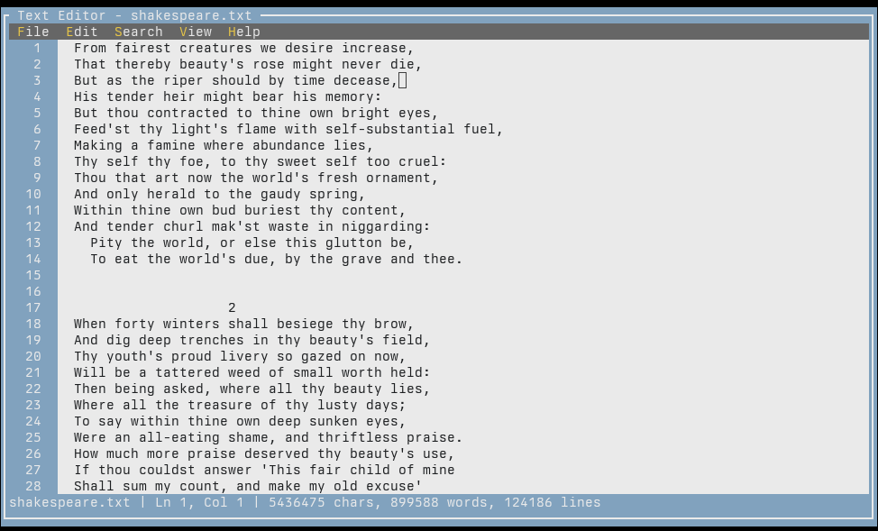
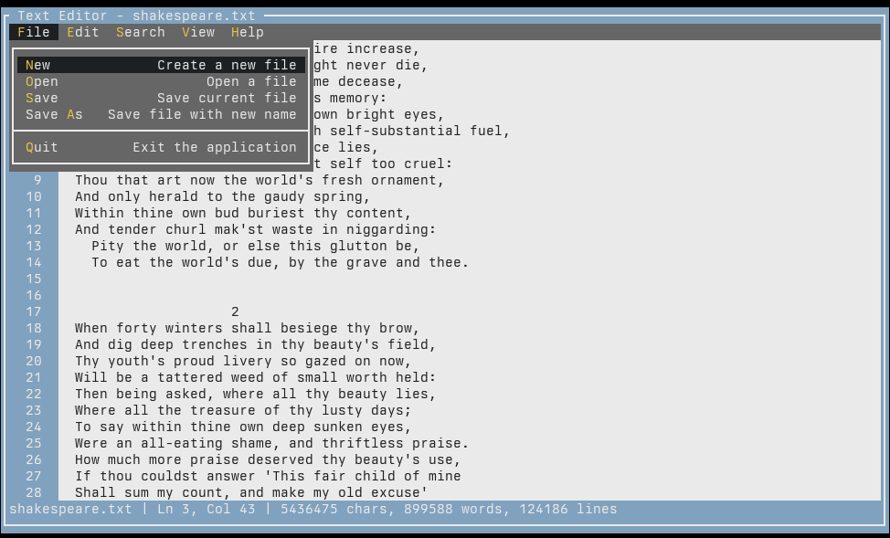

# Smalledit User Manual

Smalledit is a terminal-based text editor built with Terminal.Gui, offering essential text editing features in a simple interface.

## Basic Usage

Launch the editor with optional file path:

```
smalledit [filename]
```



## Features

### File Operations

- **New File** (File -> New): Create new empty file
- **Open File** (File -> Open): Browse and open existing files
- **Save** (File -> Save): Save current file
- **Save As** (File -> Save As): Save with new filename
- **Quit** (File -> Quit): Exit with unsaved changes protection



### Text Editing

- **Cut** (Edit -> Cut): Cut selected text to clipboard
- **Copy** (Edit -> Copy): Copy selected text to clipboard
- **Paste** (Edit -> Paste): Paste from clipboard
- **Select All** (Edit -> Select All): Select entire document

### Search Functions

- **Find** (Search -> Find / Ctrl+F): Open find dialog to search text
- **Find Next** (Search -> Find Next / Ctrl+H): Jump to next occurrence
- **Clear Highlights** (Search -> Clear Highlights): Remove search highlighting

### View Options

- **Toggle Line Numbers** (View -> Line Numbers): Show/hide line numbers
- **Toggle Word Wrap** (View -> Word Wrap): Enable/disable text wrapping

### Interface Elements

- **Menu Bar**: Access all features via File, Edit, Search, View, Help menus
- **Line Numbers**: Optional display on left side showing line numbers
- **Status Bar**: Bottom bar showing filename, cursor position (line/column), and text statistics (characters, words, lines)
- **Text Area**: Main editing area with syntax highlighting support


### Keyboard Shortcuts

- **Ctrl+F**: Open find dialog
- **Ctrl+H**: Find next occurrence
- Standard clipboard shortcuts work for cut/copy/paste

### File Status

- Modified files show asterisk (\*) in title bar and status bar
- Unsaved changes prompt confirmation on quit
- Current file path displayed in status bar
